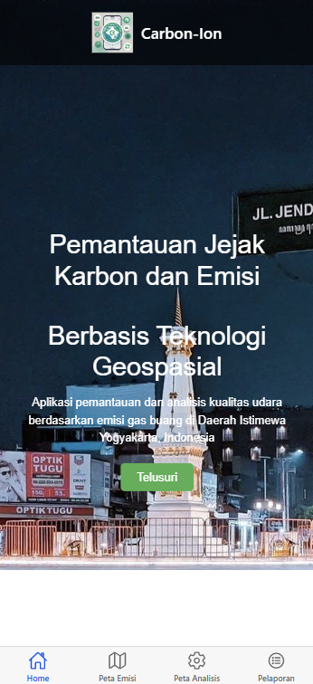
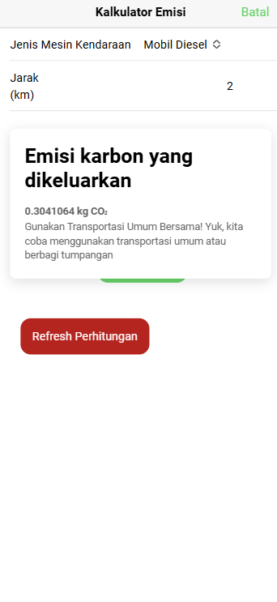
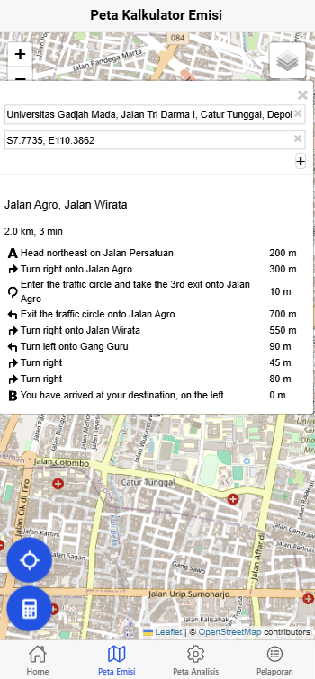
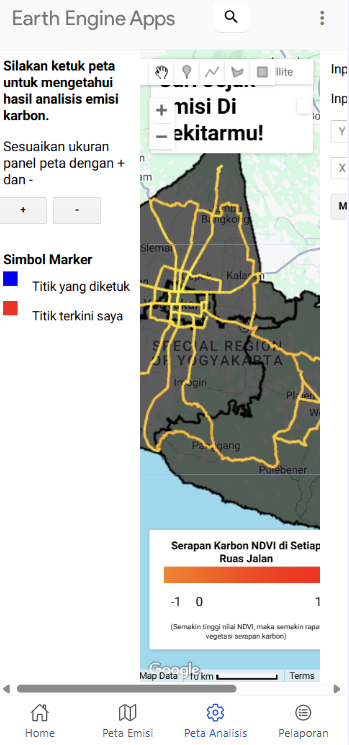
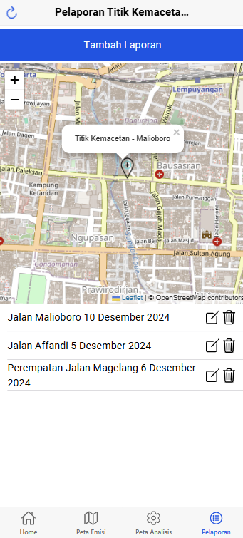

# Carbon-Ion: Aplikasi Mobile Pemantauan Emisi Karbon di Daerah Istimewa Yogyakarta

# Deskripsi
Aplikasi untuk melakukan pemantauan berdasarkan penggunaan transportasi dengan rute tertentu untuk diketahui besaran emisi yang dihasilkan. Fitur aplikasi mencakup kalkulator emisi, lokasi terkini pengguna, peta analisis yang didukung dengan Google Earth Engine untuk mengetahui kondisi kualitas udara di sekitar lokasi pengguna dengan data real-time, pelaporan untuk sebaran titik kemacetan di Yogyakarta menggunakan metode CRUD (Create, Read, Update, Delete.)

# Fitur

A. Home

-Halaman pengenalan aplikasi yang berisi overview produk

B. Peta Kalkulator Emisi dan Rute

-Halaman untuk mengetahui rute antar kedua titik dan menghitung emisi pengeluaran kendaraan bermotor berdasarkan jarak tempuh (Rumus IPCC)

C. Peta Analisis GEE

-Peta untuk mengetahui kualitas udara di sekitar pengguna disertai analisis serapan karbon di setiap ruas jalan

D.  Pelaporan Titik Kemacetan Jalanan Yogyakarta

-Form untuk memberikan informasi sebaran titik kemacetan berdasar laporan dari pengguna 

# Komponen
A. Ionic Framework: Sebagai komponen utama pembangun aplikasi mobile
B. Angular: Kerangka kerja frontend yang digunakan dalam pengembangan aplikasi Ionic
C. Leaflet: Penyedia peta interaktif beserta routing
D. PHP My Admin: Backend untuk manajemen database input data pelaporan
E. Google Earth Engine: Penyedia data satelit dan analisis spasial

# Sumber Data
A. Rumus kalkulasi emisi: Intergovernmental Panel on Climate Change (IPCC)
B. Analisis Spasial GEE: Citra Satelit Sentinel-5P dan Sentinel-2
C. Data batas administrasi Provinsi DIY

Oleh:
Khosyi Nur Aliya (22/503629/SV/21524)

